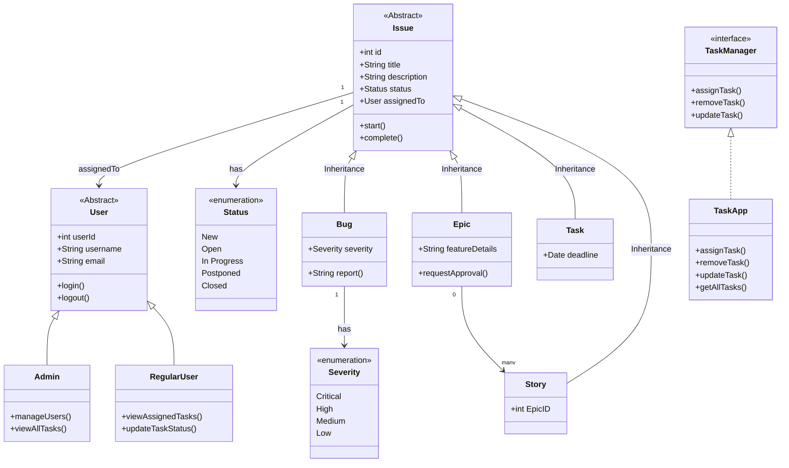

# Class Diagram

```mermaid
---
config:
  theme: default
---
classDiagram
direction TB
    class Issue {
	    +int id
	    +String title
	    +String description
	    +Status status
	    +User assignedTo
	    +start()
	    +complete()
    }
    class Bug {
	    +Severity severity
	    +String report()
    }
    class Epic {
	    +String featureDetails
	    +requestApproval()
    }
    class Story {
	    +int EpicID
    }
    class Task {
	    +Date deadline
    }
    class User {
	    +int userId
	    +String username
	    +String email
	    +login()
	    +logout()
    }
    class Admin {
	    +manageUsers()
	    +viewAllTasks()
    }
    class RegularUser {
	    +viewAssignedTasks()
	    +updateTaskStatus()
    }
    class TaskManager {
	    +assignTask()
	    +removeTask()
	    +updateTask()
    }
    class TaskApp {
	    +assignTask()
	    +removeTask()
	    +updateTask()
	    +getAllTasks()
    }
    class Status {
	    New
	    Open
	    In Progress
	    Postponed
	    Closed
    }
    class Severity {
	    Critical
	    High
	    Medium
	    Low
    }
	<<Abstract>> Issue
	<<Abstract>> User
	<<interface>> TaskManager
	<<enumeration>> Status
	<<enumeration>> Severity
    TaskManager <|.. TaskApp
    Issue "1" --> User : assignedTo
    Issue "1" --> Status : has
    Bug "1" --> Severity : has
    Issue <|-- Bug : Inheritance
    Issue <|-- Epic : Inheritance
    Issue <|-- Task : Inheritance
    Issue <|-- Story : Inheritance
    Epic "0" --> "many" Story
    User <|-- Admin
    User <|-- RegularUser
```
